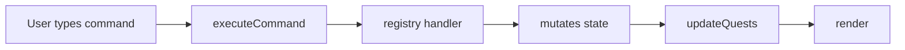
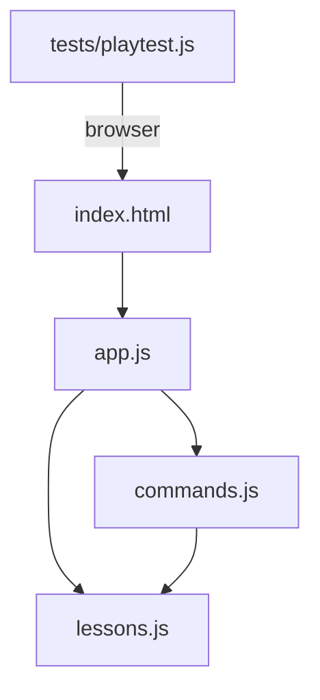

# Contributing

Thanks for helping with TermGame.

## Ground rules

- keep the project simple
- prefer plain HTML, CSS, and JavaScript over new tooling
- treat lesson clarity as a feature
- use fake secrets only
- do not commit real API keys, tokens, or screenshots that expose them

## Local setup

```bash
npm install
npx playwright install chromium
npm test
```

For manual development:

```bash
npm run dev
```

## Architecture

How a keystroke becomes a completed quest:



Which files depend on which:



## Where to make changes

| File | What lives there |
|---|---|
| `src/lessons.js` | Quest definitions, state shape, glossary concepts, tool configs |
| `src/commands.js` | Command registry — each handler is a self-contained `register()` call |
| `src/app.js` | UI rendering and event wiring (rarely changes for new quests) |
| `src/styles.css` | Styles |
| `tests/playtest.js` | Playwright E2E tests |

## Adding a new quest

Every exercise is a **quest** — one step the user types in the terminal. A quest lives in three places: `lessons.js` (definition), `commands.js` (handler), and `playtest.js` (test).

### Quest format

A quest object in the `buildQuests()` array in `src/lessons.js`:

```js
{
  id: "my-quest",          // Unique string. Used as key in state.questsDone.
  part: 1,                 // 1 = Make something, 2 = Put it online, 3 = Beyond websites
  title: "Do the thing",   // Shown in the quest list sidebar
  helper: "Why this matters and what the command does. HTML is OK.",
  commands: ["the-command arg1"],  // Shown as "Type this" — can list multiple
  check: (state) => state.myFlag   // Returns true when the quest is complete
}
```

**Order matters.** Quests render in array order within their part. The user sees only the current quest plus one locked quest ahead.

### Step by step

1. **Add state** — if your quest needs a new completion flag, add a boolean to `makeInitialState()` in `src/lessons.js` (e.g. `myFlag: false`).

2. **Add the quest** — insert your quest object in the `buildQuests()` array at the right position.

3. **Add a command handler** — in `src/commands.js`, call `register("mycommand", handler)`. Each handler receives `(state, args, command, tool, context)`. Validate prerequisites, update state, and call `context.addLine()`. Line kinds: `"system"` (neutral), `"info"` (success), `"warn"` (guidance), `"error"` (red). The `help` command auto-lists all registered names.

4. **Add glossary entries** (optional) — new concepts go in `BASE_CONCEPTS` in `lessons.js`. Wire them into `getActiveHintIds()` so they appear in the sidebar when your quest is active.

5. **Update `skip`** — the `skip` command in `commands.js` auto-completes earlier parts. If your quest is in Part 1 or 2, make sure `skip` sets the state flags your `check` needs.

6. **Add tests** — in `tests/playtest.js`, add your command to the happy-path `runFlow()` sequence and update the `assertQuestCount`. Add error-path assertions for wrong-order usage.

7. **Run tests** — `npm test`

### Worked example: how Part 3 was added

Part 3 added 4 quests reusing the same workflow for a local script:

1. **State**: `scriptBuilt`, `scriptReviewed`, `scriptRan` added to `makeInitialState()`
2. **Quests**: `new-project`, `agent-script`, `review-script`, `run-script` added with `part: 3`
3. **Commands**: Extended `codex`/`claude` handler to detect `cwd === scriptProjectDir()` and create script files. Added `node` command. Extended `cat` to set `scriptReviewed`.
4. **Glossary**: Added `node-run`, `local-tools`, `same-workflow`
5. **Skip**: `skip 3` sets all Part 1+2 state and creates the `file-sorter` directory
6. **Tests**: Added Part 3 commands to happy path, plus `runPart3ReloadTests()`

## Contribution style

- small pull requests are easiest to review
- keep copy short and beginner-friendly
- preserve the current tone: helpful, practical, and not overly technical
- if you add a new quest or command, update the test

## Simulated behavior

This app intentionally simulates shell behavior. That means:
- it is okay to simplify real command behavior
- but the lesson should still teach correct mental models
- if you simplify something, try to make the simplification obvious in the copy

## Ideas for extensions

Each is self-contained and follows the quest-authoring pattern above:

- ~~**`.env` file quest**~~ — ✅ implemented (two quests: create `.env`, add `.gitignore`)
- **API route quest** — add a backend route that keeps a secret key server-side. Teaches frontend vs backend.
- **Windows track** — the lesson assumes Mac (Homebrew, `~/.zshrc`). A parallel track could use `winget` and PowerShell profile. The quest system already supports per-tool tracks; this would add per-OS.
- **More terminal concepts** — teach `ls -la`, `rm`, `mv`, `cp`, pipes, or redirects as optional side quests. Could also cover text editor basics beyond nano (e.g. a vim survival quest).
- **Mobile layout** — the two-column layout stacks on narrow screens but could use better touch targets and scroll behavior.
- ~~**Typo hints**~~ — ✅ implemented (edit-distance suggestion in `commands.js`)
- ~~**Progress bar**~~ — ✅ implemented ("N of 20" count in quest header)
